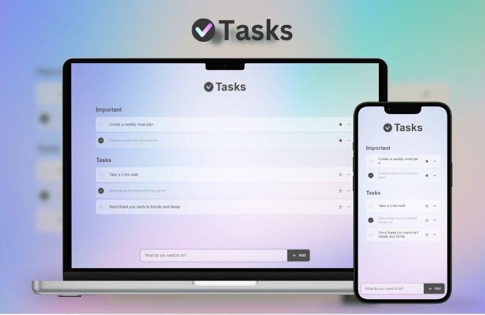
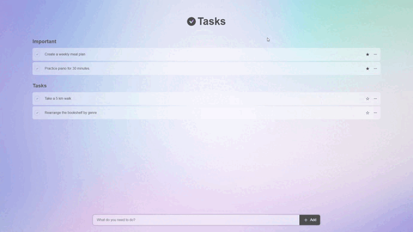

# 📝 Aplicativo de Lista de Tarefas



Um aplicativo web simples e intuitivo de Lista de Tarefas construído com React. Acompanhe suas tarefas facilmente com esta interface amigável.

## 🚀 Demonstração



## ✨ Recursos

- **Adicionar, Editar e Deletar Tarefas:** Gerencie suas tarefas facilmente com operações CRUD simples.
- **Marcar Tarefas como Importantes:** Destaque tarefas importantes para distingui-las das outras.
- **Marcar Tarefas como Concluídas:** Acompanhe as tarefas concluídas marcando-as como feitas.
- **Suporte ao Armazenamento Local:** Suas tarefas persistem mesmo após recarregar a página, graças ao armazenamento local.

## 🛠️ Instalação

1. Clone o repositório para sua máquina local:

```bash
   git clone <url-do-repositório>
```

2. Navegue até o diretório do projeto:

```bash
   cd <diretório-do-projeto>
```

3. Instale as dependências usando npm ou yarn:
 ```bash
    npm install
    # ou
    yarn install
```
## 🖥️ Uso
Para executar o aplicativo localmente, execute o seguinte comando:
 ```bash
    npm start
    # ou
    yarn start
```
O aplicativo será servido em http://localhost:3000 por padrão.

## 📦 Arquivos do Pacote
* `.upm`: Contém configurações do projeto e dependências.
* `node_modules`: Contém todas as dependências instaladas para o projeto.
* `package-lock.json`: Arquivo gerado automaticamente usado para bloqueio de versão de dependências.
* `package.json`: Contém metadados e informações de dependências do projeto.

## 🤝 Contribuição
Contribuições são bem-vindas! Sinta-se à vontade para enviar um pull request ou abrir uma issue se encontrar algum bug ou quiser propor novos recursos.


## 📄 Licença
Este projeto está licenciado sob a Licença MIT.


